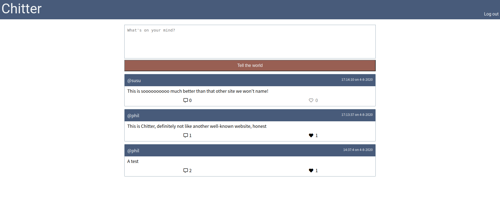

# Chitter


This is a simplified clone of Twitter, including authorisation, posting tweets, commenting and liking. The motivations for completing this project were as follows:

- to learn Typescript, which I had never used before
- to reinforce my React knowledge, and learn to use React with Typescript
- to produce a simple full stack project
- to use a PostgreSQL database with plain SQL and JavaScript 
- to learn to use Circle CI in conjunction with Netlify for the front end

I specifically chose to implement this project as two separate repositories, one for the back end and one for the front end. These contain the project's code and can be found here:

- [front end](https://github.com/PhilipVigus/chitter-typescript-frontend)
- [back end](https://github.com/PhilipVigus/chitter-typescript-backend)

The project is deployed and can be tried [here!](https://chitter-ts.netlify.app/)

## Technologies used

| Purpose | Technology |
|:--------|:-----------|
| Language | Typescript |
| Front end | React with functional components and hooks |
| Back end | Express |
| Database | PostgreSQL |
| Testing | Jest, React Testing Library (front end), Jest, Supertest (back end) |
| CI/CD | Circle CI, Netlify (front end), Heroku (back end) |

## Getting started

```bash
# clone the repositories to your local machine with either
# if you're using ssh
git clone git@github.com:PhilipVigus/chitter-typescript-backend.git
git clone git@github.com:PhilipVigus/chitter-typescript-frontend.git

# if you're using https
git clone git@github.com:PhilipVigus/chitter-typescript-backend.git
git clone git@github.com:PhilipVigus/chitter-typescript-frontend.git

# install project dependencies in each repository's root folder
yarn install
```

### Back end

You must have PostgreSQL installed on your machine in order to run the back end locally. You also need to create a .env in the project root with the following variables. All other database connection settings are assumed to be defaults:

```
DB_PASSWORD=<your_password>
DB_USERNAME=<your_username>
```

You need to create two databases on your local machine, chitter_test and chitter_dev. Once created you then need to run the SQL commands found in the db/migrations folder on each database to set up the database structure.

### Front end

You need to create a .env in the project root with the following variable:

```
REACT_APP_BACKEND_URL=http://localhost:5000
```

### Starting the app locally

Assuming everything is set up as specified above, you can start the app as follows:

```bash
# back end root folder
yarn dev:start

# front end root folder
yarn start
```

### Testing

```bash
# back or front end root folder
# interactive
yarn test

# coverage statistics
yarn testWithCoverage
```

## Approach

I deliberately kept the user stories simple for this project, as my main focus was on learning Typescript. They essentially boiled down to:

```
As a user,

So that other users can't post messages as me,
I want to be able to sign up to the site.
```

```
As a user,

So that I can post messages as myself,
I want to be able to login.
```

```
As a user,

So that I can prevent others posting messages as me,
I want to be able to logout.
```

```
As a user,

So that I can share what I think with others,
I want to be able to post a peep.
```

```
As a user,

So that I can share my thoughts with other users,
I want to be able to comment on peeps
```

```
As a user,

So that I can show which peeps I enjoy,
I want to be able to 'like' a peep
```

- As noted in the introduction, I deliberately chose to implement this project across two separate repositories. This was not something I had done before, and I wanted to practice working through any challenges the approach might have. At first I found it difficult to split development between the two repositories, and found myself having to go back and make changes because of incorrect assumptions I had made about the interface between the front and back end that proved to be incorrect. As I progressed though I learned a process that prevented this from happening in the majority of cases.
- Most features were developed starting with the front end and gradually implementing further towards the back end. I generally find this to be the most intuitive and logical way of developing full stack projects, and it allows me to focus entirely on one feature before moving onto the next.
- Typescript was challenging to learn, particularly in the context of this project. In retrospect it would almost certainly have been easier to start with something a little simpler for my first use of the language!
- I am happy with my React functional components and use of hooks. It was the first time I'd really used contexts, and I was satisfied that I was able to implement shared state for the application
- I am very pleased with my testing.
  - I was able to fully employ TDD across the board, which particularly showed how much more confident I am now with React.
  - I have completely separate environments set up for developing and testing, each with their own databases.
  - I was interested to learn to use supertest to isolate testing of the back end routes.
  - Mocking is generally employed so that the front and back ends are fully isolated for during testing 

## Areas for further development

- Although passwords are encrypted in the database, authorisation is still relatively simplistic, as it was never intended as a focus for the project. I would like to implement JWT with Passport and possibly Auth0 at some point in the future, as I have not used that approach before.
- I would like to convert the front end to use styled components rather than the plain css that is currently used, as well as using CSS transitions and/or a React animation library of some description
- There are various additional features I could implement. At the top of this list would be following users, retweets and liking comments
